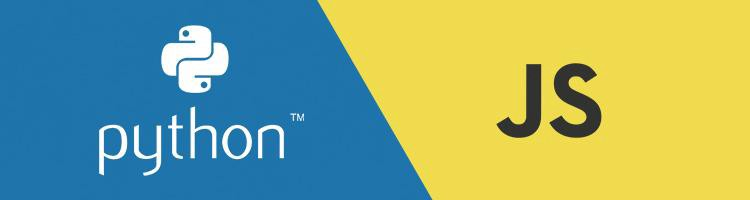

<h1 align="center">
    Olá pessoas!
</h1>

<link rel="stylesheet" href="https://stackpath.bootstrapcdn.com/font-awesome/4.7.0/css/font-awesome.min.css">

  <a href="#cyclone-quem-sou-eu">Quem sou eu?</a>&nbsp;&nbsp;&nbsp;|&nbsp;&nbsp;&nbsp;
  <a href="#rocket-tecnologias">Tecnologias</a>&nbsp;&nbsp;&nbsp;|&nbsp;&nbsp;&nbsp;
  <a href="#notebook-areas-de-interesse">Áreas de interesse</a>&nbsp;&nbsp;&nbsp;|&nbsp;&nbsp;&nbsp;

 

  

<h1 align="center">
    <a href="https://github.com/tiagod3p" target="_blank"><i class="fa fa-github-square" aria-hidden="true"></i></a>
    <a href="https://twitter.com/tiagod3p" target="_blank"><i class="fa fa-twitter-square" aria-hidden="true" width=140px ></i></a>
</h1>

## :cyclone: Quem sou eu

Meu nome é Tiago, tenho 19 anos, estou cursando Bacharelado em Engenharia Elétrica com ênfase em Softwares e amo aprender e ensinar sobre programação! Acredito que com a tecnologia é possível mudar o mundo, e esse é o meu objetivo!

## :rocket: Tecnologias

- HTML
- CSS
- Javascript
- Python
- SQL

Atualmente estou focando em me aprofundar no desenvolvimento web com Javascript full-stack. Para isso estou estudando sobre Node, Express, PostgreSQL, React e Angular.
 
## :notebook: Areas de interesse

:pushpin: Desenvolvimento WEB 

:pushpin: Clean Code 

:pushpin: Criação de aplicativos mobile

:pushpin: Machine Learning

:pushpin: Inteligência Artificial

:pushpin: Ensinar programação

:pushpin: Aprender para sempre!

Estou sempre aberto a novas amizades que venham para agregar. Compartilhar conhecimento é comigo mesmo! Contacte-me:

- <a href="https://github.com/tiagod3p" target="_blank"><i class="fa fa-github-square" aria-hidden="true"></i></a>
- <a href="https://twitter.com/tiagod3p" target="_blank"><i class="fa fa-twitter-square" aria-hidden="true" width=140px ></i></a>
- <a href="https://www.linkedin.com/in/tiagovidaldepaula/" target="_blank"><i class="fa fa-linkedin-square" aria-hidden="true" width=140px ></i></a>
- <a href="mailto:tiagod3p@gmail.com" target="_blank"><i class="fa fa-envelope-square" aria-hidden="true" width=140px ></i></a>

